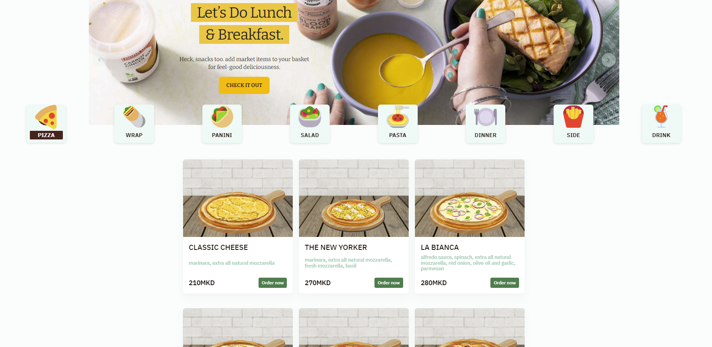

# Fast Food Customer Facing App Next.JS

This is a really simple project that shows the usage of Next.js with TypeScript.

## Project Overview
This Fast Food Customer Facing App provides an online ordering system built with Next.js and TypeScript, aimed at delivering a seamless ordering experience for fast food customers.



## Deploy your own

Deploy the example using [Vercel](https://vercel.com):

[](https://vercel.com/import/project?template=https://github.com/vercel/next.js/tree/canary/examples/with-typescript)

## How to use it?

Execute [`create-next-app`](https://github.com/vercel/next.js/tree/canary/packages/create-next-app) with [npm](https://docs.npmjs.com/cli/init) or [Yarn](https://yarnpkg.com/lang/en/docs/cli/create/) to bootstrap the example:

```bash
npx create-next-app --example with-typescript with-typescript-app
# or
yarn create next-app --example with-typescript with-typescript-app
```

Deploy it to the cloud with [Vercel](https://vercel.com/import?filter=next.js&utm_source=github&utm_medium=readme&utm_campaign=next-example) ([Documentation](https://nextjs.org/docs/deployment)).

## Notes

This example shows how to integrate the TypeScript type system into Next.js. Since TypeScript is supported out of the box with Next.js, all we have to do is to install TypeScript.

```
npm install --save-dev typescript
```

To enable TypeScript's features, we install the type declarations for React and Node.

```
npm install --save-dev @types/react @types/react-dom @types/node
```

When we run `next dev` the next time, Next.js will start looking for any `.ts` or `.tsx` files in our project and builds it. It even automatically creates a `tsconfig.json` file for our project with the recommended settings.

Next.js has built-in TypeScript declarations, so we'll get autocompletion for Next.js' modules straight away.

A `type-check` script is also added to `package.json`, which runs TypeScript's `tsc` CLI in `noEmit` mode to run type-checking separately. You can then include this, for example, in your `test` scripts.


## Image Resizer

Before push to server we have a husky hook that runs the `imageResizer.ts` in the root directory of the project. It generates `compressedImages.ts` which is the `base64` representation of minimized thumbnails of all images in the `public/images` folder.

Ensure that these files locations are not moved because everything configured to work within the current locations.

## Design and Prototyping
View the Figma design for UI details and user flow here: Figma Design Link.
https://www.figma.com/design/34obRb30USGJNslQMxBSxT/Fast-Food-Restaurant?node-id=1-24642&t=g9ScsO2kFeH2mLug-1
